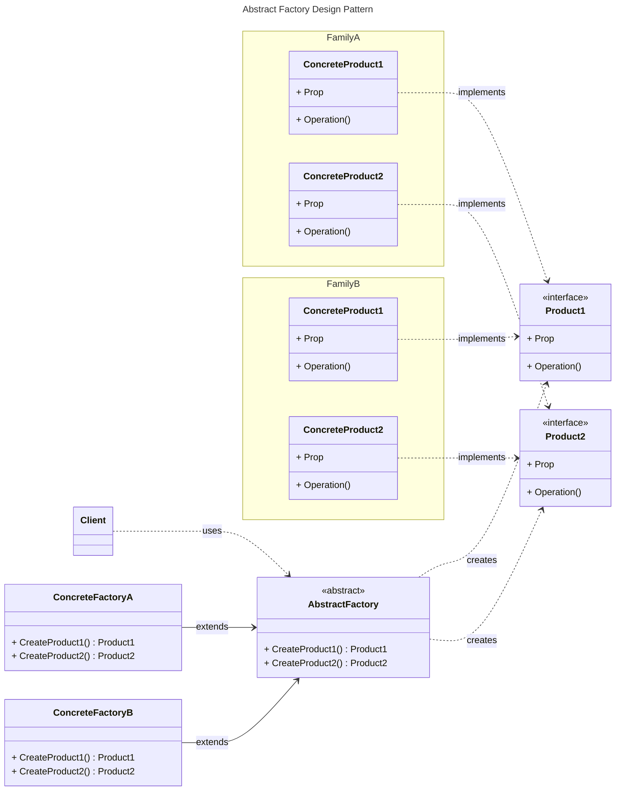

# Design Diagram

```mermaid
---
title: Abstract Factory Design Pattern
---
classDiagram
    direction LR
    Client ..> AbstractFactory: uses
    ConcreteFactoryA --> AbstractFactory: extends
    ConcreteFactoryB --> AbstractFactory: extends
    AbstractFactory ..> Product1: creates
    AbstractFactory ..> Product2: creates
    ConcreteProductA1 ..> Product1: implements
    ConcreteProductA2 ..> Product2: implements
    ConcreteProductB1 ..> Product1: implements
    ConcreteProductB2 ..> Product2: implements
    class Client {
    }
    class AbstractFactory {
        <<abstract>>
        + CreateProduct1() Product1
        + CreateProduct2() Product2
    }
    class ConcreteFactoryA {
        + CreateProduct1() Product1
        + CreateProduct2() Product2
    }
    class ConcreteFactoryB {
        + CreateProduct1() Product1
        + CreateProduct2() Product2
    }
    class Product1 {
        <<interface>>
        + Prop
        + Operation()
    }
    class Product2 {
        <<interface>>
        + Prop
        + Operation()
    }
    namespace FamilyA {
        class ConcreteProductA1["ConcreteProduct1"] {
            + Prop
            + Operation()
        }
        class ConcreteProductA2["ConcreteProduct2"] {
            + Prop
            + Operation()
        }
    }
    namespace FamilyB {
        class ConcreteProductB1["ConcreteProduct1"] {
            + Prop
            + Operation()
        }
        class ConcreteProductB2["ConcreteProduct2"] {
            + Prop
            + Operation()
        }
    }
```
