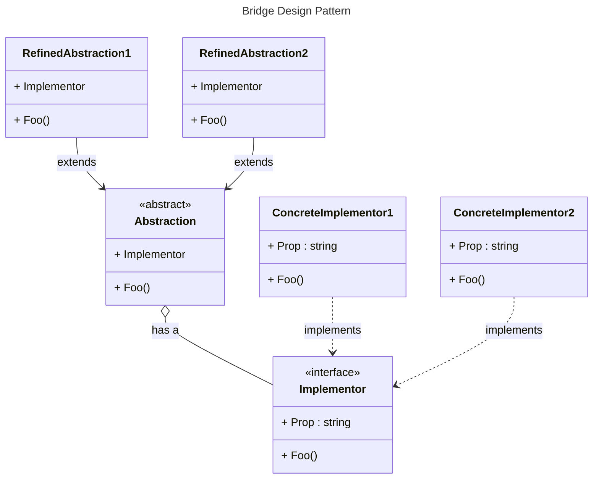

# Design Diagram

```mermaid
---
title: Bridge Design Pattern
---
classDiagram
    Abstraction o-- Implementor: has a
    RefinedAbstraction1 --> Abstraction: extends
    RefinedAbstraction2 --> Abstraction: extends
    ConcreteImplementor1 ..> Implementor: implements
    ConcreteImplementor2 ..> Implementor: implements
    class Abstraction {
        <<abstract>>
        + Implementor
        + Foo()
    }
    class Implementor {
        <<interface>>
        + Prop : string
        + Foo()
    }
    class RefinedAbstraction1 {
        + Implementor
        + Foo()
    }
    class RefinedAbstraction2 {
        + Implementor
        + Foo()
    }
    class ConcreteImplementor1 {
        + Prop : string
        + Foo()
    }
    class ConcreteImplementor2 {
        + Prop : string
        + Foo()
    }
```
