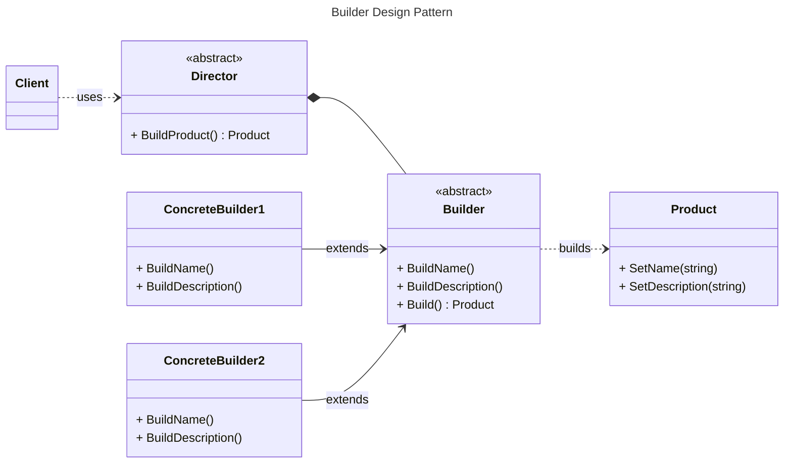

# Design Diagram

```mermaid
---
title: Builder Design Pattern
---
classDiagram
    direction LR
    Client ..> Director: uses
    Director *-- Builder
    Builder ..> Product: builds
    ConcreteBuilder1 --> Builder: extends
    ConcreteBuilder2 --> Builder: extends
    class Client {
    }
    class Director {
        <<abstract>>
        + BuildProduct() Product
    }
    class Builder {
        <<abstract>>
        + BuildName()
        + BuildDescription()
        + Build() Product
    }
    class ConcreteBuilder1 {
        + BuildName()
        + BuildDescription()
    }
    class ConcreteBuilder2 {
        + BuildName()
        + BuildDescription()
    }
    class Product {
        + SetName(string)
        + SetDescription(string)
    }
```
