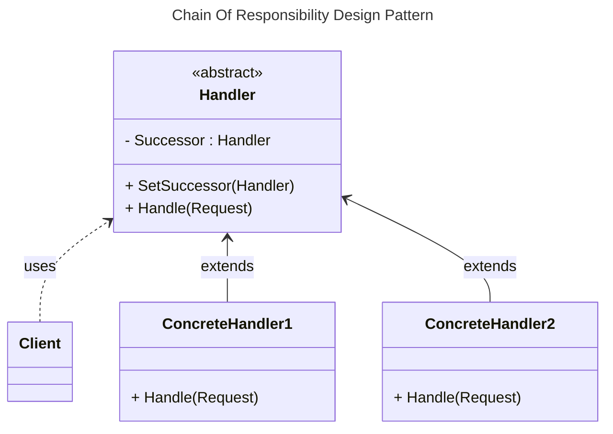

# Design Diagram

```mermaid
---
title: Chain Of Responsibility Design Pattern
---
classDiagram
    direction BT
    Client ..> Handler: uses
    ConcreteHandler1 --> Handler: extends
    ConcreteHandler2 --> Handler: extends
    class Client {
    }
    class Handler {
        <<abstract>>
        - Successor : Handler
        + SetSuccessor(Handler)
        + Handle(Request)
    }
    class ConcreteHandler1 {
        + Handle(Request)
    }
    class ConcreteHandler2 {
        + Handle(Request)
    }
```
