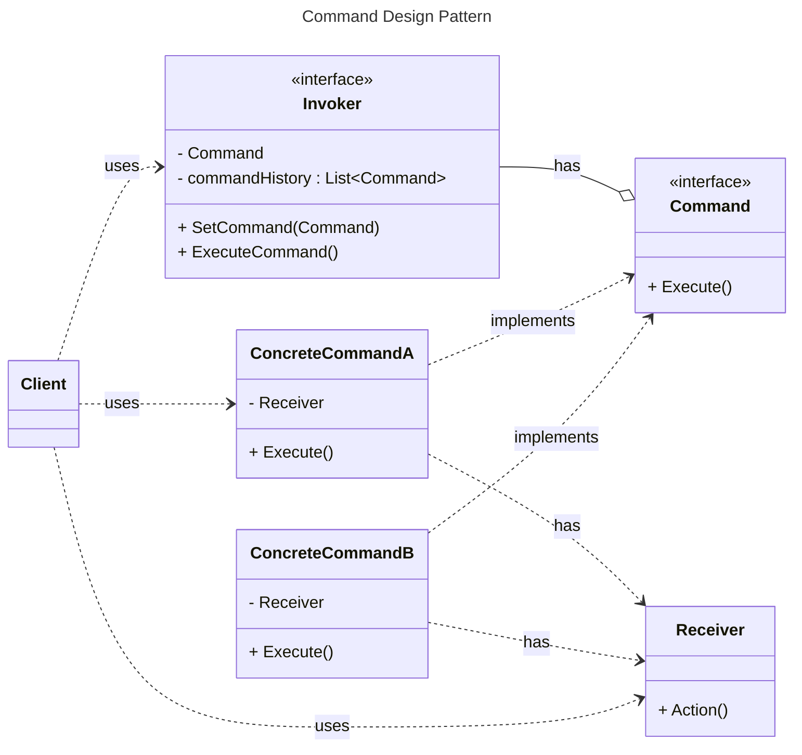

# Design Diagram

```mermaid
---
title: Command Design Pattern
---
classDiagram
    direction LR
    Client ..> Invoker: uses
    Invoker --o Command: has
    ConcreteCommandA ..> Command: implements
    ConcreteCommandB ..> Command: implements
    ConcreteCommandA ..> Receiver: has
    ConcreteCommandB ..> Receiver: has
    Client ..> ConcreteCommandA: uses
    Client ..> Receiver: uses
    class Client {
    }
    class Invoker {
        <<interface>>
        - Command
        - commandHistory : List~Command~
        + SetCommand(Command)
        + ExecuteCommand()
    }
    class Command {
        <<interface>>
        + Execute()
    }
    class ConcreteCommandA {
        - Receiver
        + Execute()
    }
    class ConcreteCommandB {
        - Receiver
        + Execute()
    }
    class Receiver {
        + Action()
    }
```
