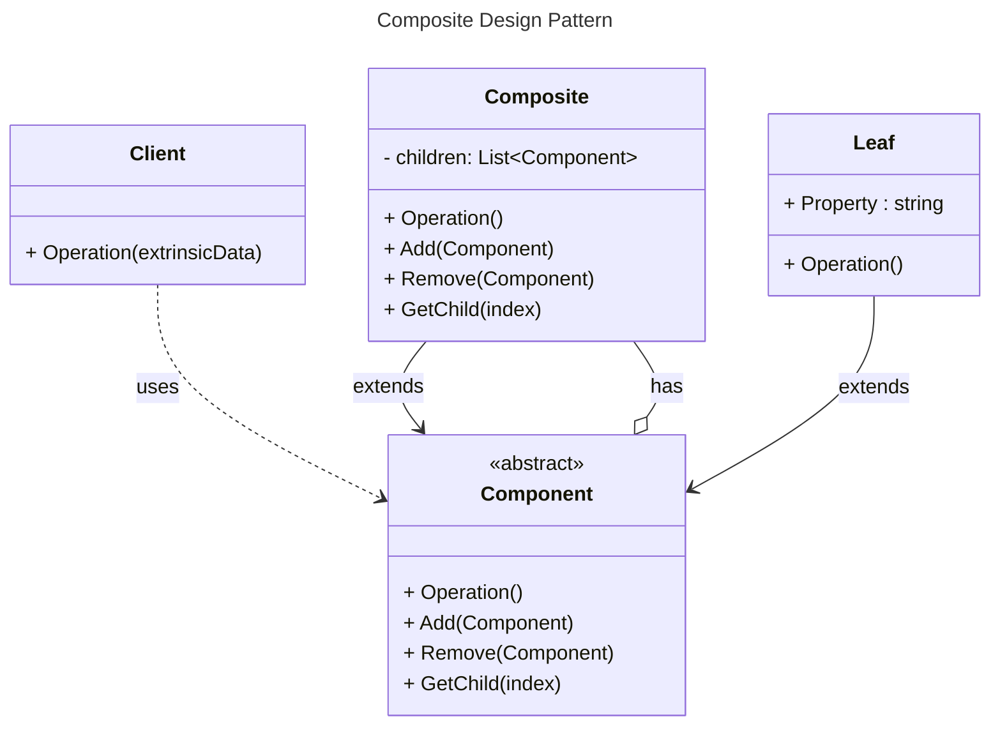

# Design Diagram

```mermaid
---
title: Composite Design Pattern
---
classDiagram
    direction TB
    Client ..> Component: uses
    Composite --> Component: extends
    Composite --o Component: has
    Leaf --> Component: extends
    class Client {
        + Operation(extrinsicData)
    }
    class Component {
        <<abstract>>
        + Operation()
        + Add(Component)
        + Remove(Component)
        + GetChild(index)
    }
    class Composite {
        - children: List~Component~
        + Operation()
        + Add(Component)
        + Remove(Component)
        + GetChild(index)
    }
    class Leaf {
        + Property : string
        + Operation()
    }
```
