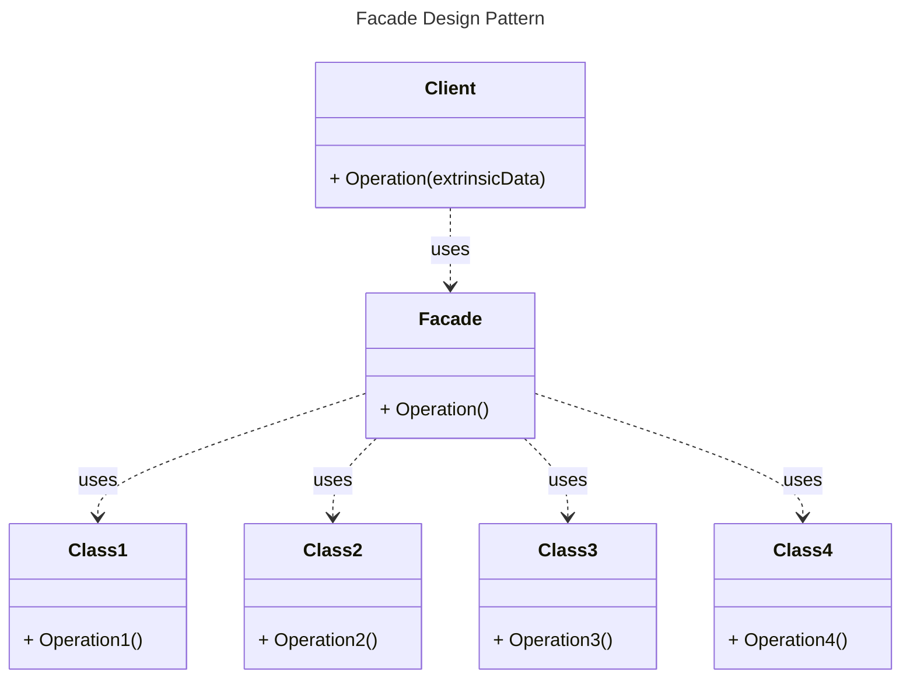

# Design Diagram

```mermaid
---
title: Facade Design Pattern
---
classDiagram
    direction TB
    Client ..> Facade: uses
    Facade ..> Class1: uses
    Facade ..> Class2: uses
    Facade ..> Class3: uses
    Facade ..> Class4: uses
    class Client {
        + Operation(extrinsicData)
    }
    class Facade {
        + Operation()
    }
    class Class1 {
        + Operation1()
    }
    class Class2 {
        + Operation2()
    }
    class Class3 {
        + Operation3()
    }
    class Class4 {
        + Operation4()
    }
```
