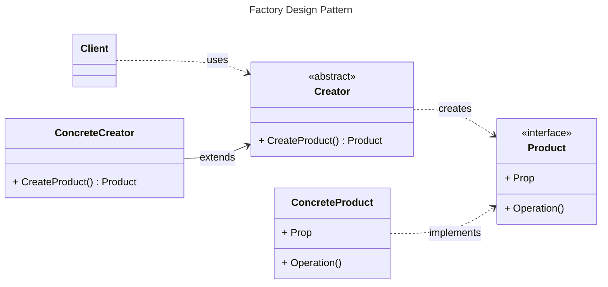

# Design Diagram

```mermaid
---
title: Factory Design Pattern
---
classDiagram
    direction LR
    Client ..> Creator: uses
    ConcreteCreator --> Creator: extends
    Creator ..> Product: creates
    ConcreteProduct ..> Product: implements
    class Client {
    }
    class Creator {
        <<abstract>>
        + CreateProduct() Product
    }
    class Product {
        <<interface>>
        + Prop
        + Operation()
    }
    class ConcreteCreator {
        + CreateProduct() Product
    }
    class ConcreteProduct {
        + Prop
        + Operation()
    }
```
