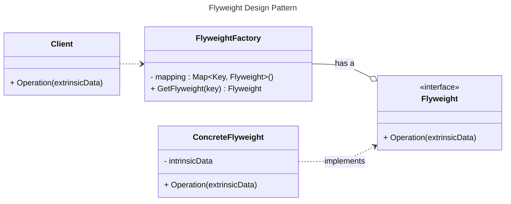

# Design Diagram

```mermaid
---
title: Flyweight Design Pattern
---
classDiagram
    direction LR
    Client ..> FlyweightFactory
    FlyweightFactory --o Flyweight: has a
    ConcreteFlyweight ..> Flyweight: implements
    class Client {
        + Operation(extrinsicData)
    }
    class Flyweight {
        <<interface>>
        + Operation(extrinsicData)
    }
    class FlyweightFactory {
        - mapping : Map~Key, Flyweight~()
        + GetFlyweight(key) Flyweight
    }
    class ConcreteFlyweight {
        - intrinsicData
        + Operation(extrinsicData)
    }
```
