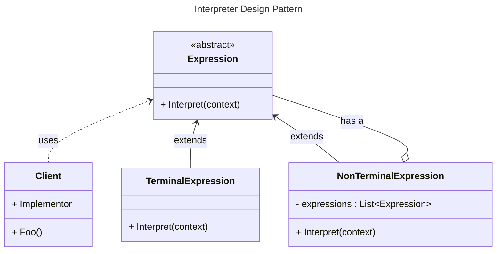

# Design Diagram

```mermaid
---
title: Interpreter Design Pattern
---
classDiagram
    direction BT
    Client ..> Expression: uses
    TerminalExpression --> Expression: extends
    NonTerminalExpression --> Expression: extends
    NonTerminalExpression o-- Expression: has a
    class Client {
        + Implementor
        + Foo()
    }
    class Expression {
        <<abstract>>
        + Interpret(context)
    }
    class TerminalExpression {
        + Interpret(context)
    }
    class NonTerminalExpression {
        - expressions : List~Expression~
        + Interpret(context)
    }
```
