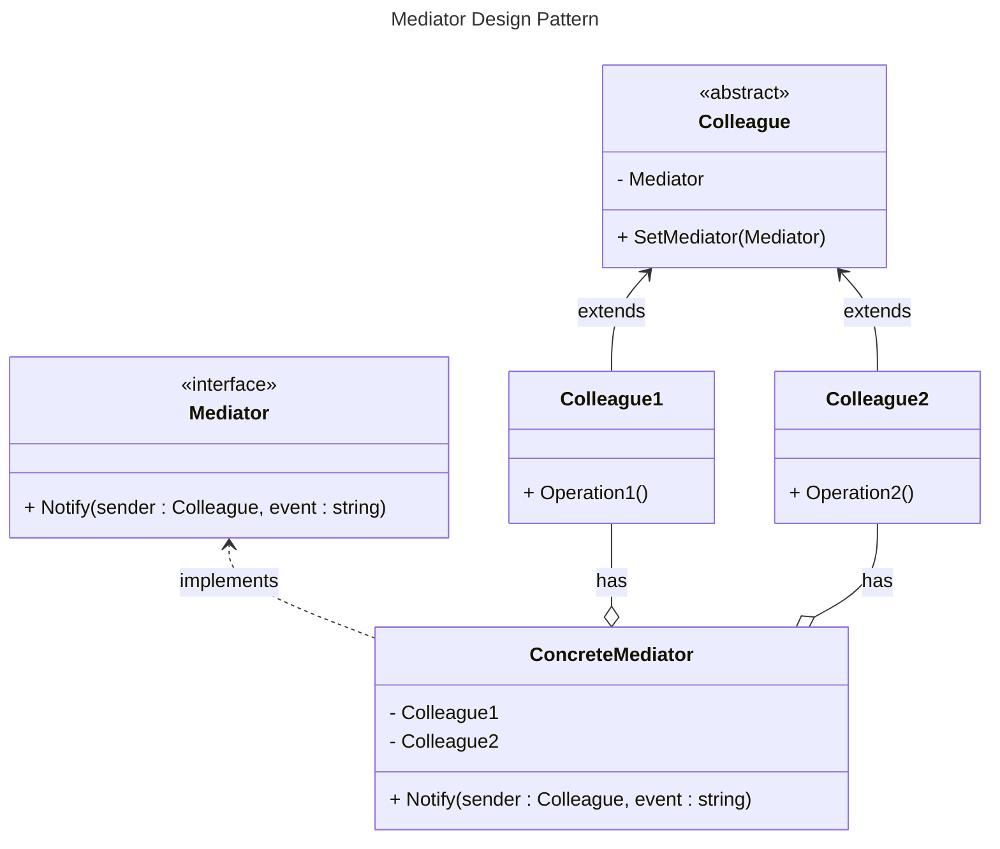

# Design Diagram

```mermaid
---
title: Mediator Design Pattern
---
classDiagram
    direction BT
    ConcreteMediator ..> Mediator: implements
    ConcreteMediator o-- Colleague1: has
    ConcreteMediator o-- Colleague2: has
    Colleague1 --> Colleague: extends
    Colleague2 --> Colleague: extends
    class Mediator {
        <<interface>>
        + Notify(sender : Colleague, event : string)
    }
    class Colleague {
        <<abstract>>
        - Mediator
        + SetMediator(Mediator)
    }
    class ConcreteMediator {
        - Colleague1
        - Colleague2
        + Notify(sender : Colleague, event : string)
    }
    class Colleague1 {
        + Operation1()
    }
    class Colleague2 {
        + Operation2()
    }
```
