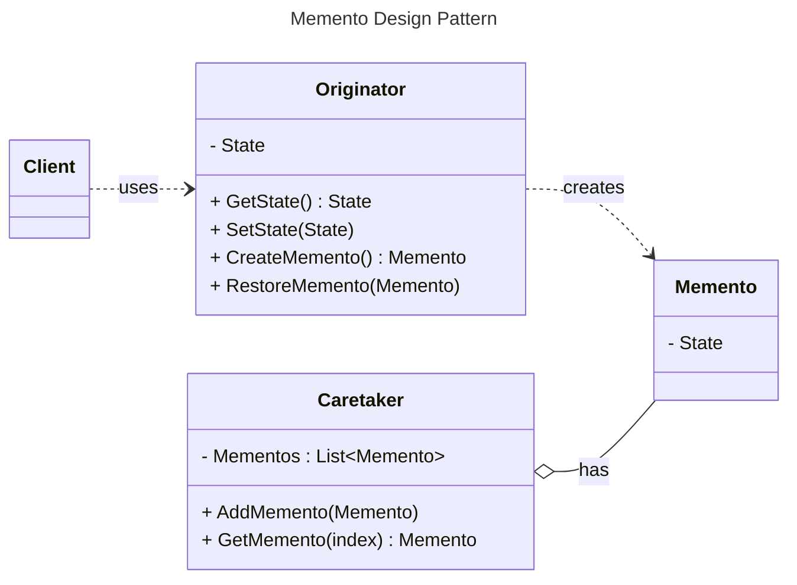

# Design Diagram

```mermaid
---
title: Memento Design Pattern
---
classDiagram
    direction LR
    Client ..> Originator: uses
    Originator ..> Memento: creates
    Caretaker o-- Memento: has
    class Client {
    }
    class Originator {
        - State
        + GetState() State
        + SetState(State)
        + CreateMemento() Memento
        + RestoreMemento(Memento)
    }
    class Memento {
        - State
    }
    class Caretaker {
        - Mementos : List~Memento~
        + AddMemento(Memento)
        + GetMemento(index) Memento
    }
```
