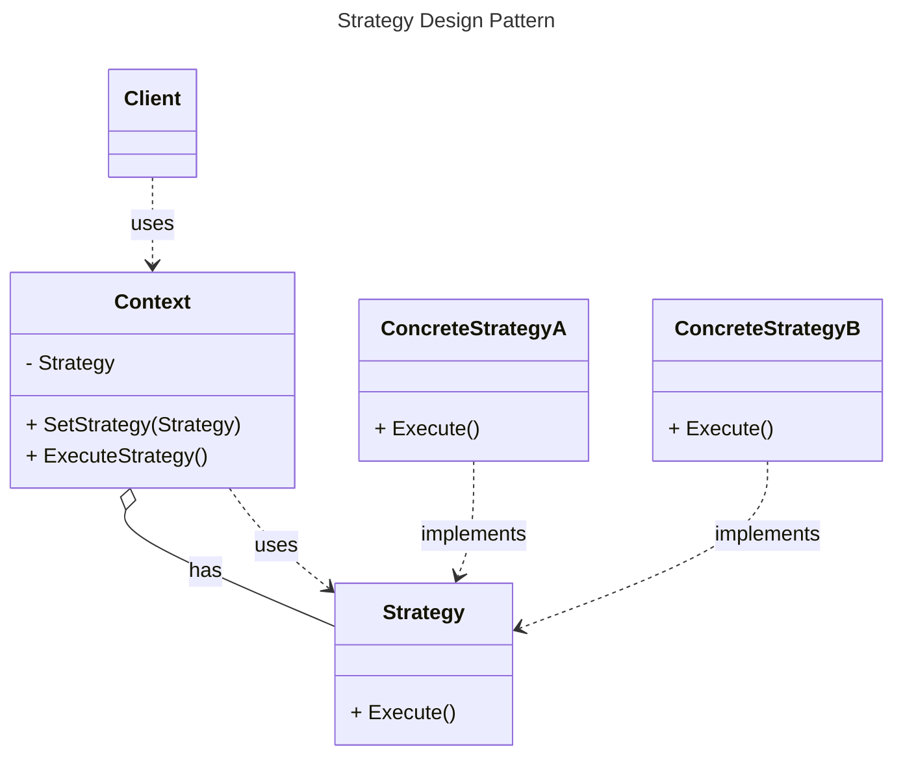

# Design Diagram

```mermaid
---
title: Strategy Design Pattern
---
classDiagram
    direction TB
    Client ..> Context: uses
    Context o-- Strategy: has
    Context ..> Strategy: uses
    ConcreteStrategyA ..> Strategy: implements
    ConcreteStrategyB ..> Strategy: implements
    class Client {
    }
    class Context {
        - Strategy
        + SetStrategy(Strategy)
        + ExecuteStrategy()
    }
    class Strategy {
        + Execute()
    }
    class ConcreteStrategyA {
        + Execute()
    }
    class ConcreteStrategyB {
        + Execute()
    }
```
