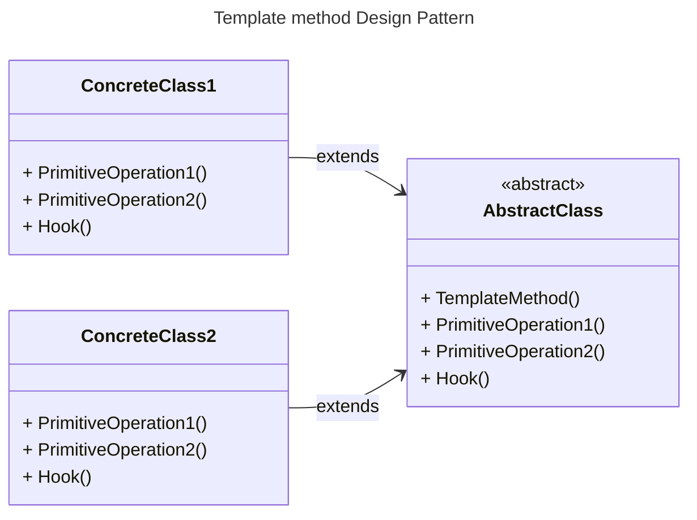

# Design Diagram

```mermaid
---
title: Template method Design Pattern
---
classDiagram
    direction LR
    ConcreteClass1 --> AbstractClass: extends
    ConcreteClass2 --> AbstractClass: extends
    class AbstractClass {
        <<abstract>>
        + TemplateMethod()
        + PrimitiveOperation1()
        + PrimitiveOperation2()
        + Hook()
    }
    class ConcreteClass1 {
        + PrimitiveOperation1()
        + PrimitiveOperation2()
        + Hook()
    }
    class ConcreteClass2 {
        + PrimitiveOperation1()
        + PrimitiveOperation2()
        + Hook()
    }
```
