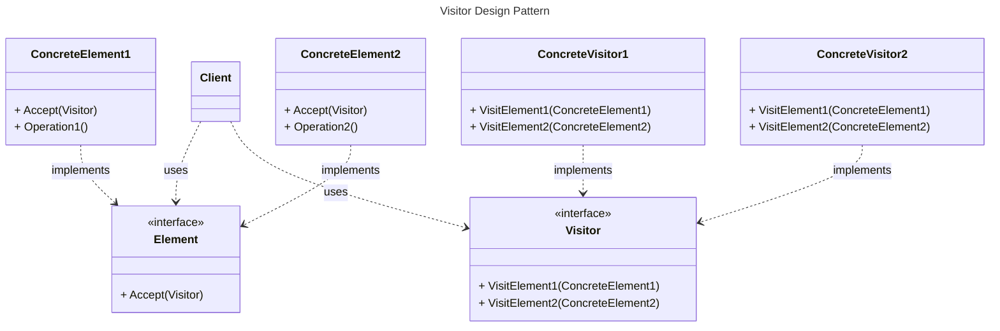

# Design Diagram

```mermaid
---
title: Visitor Design Pattern
---
classDiagram
    Client ..> Element: uses
    ConcreteElement1 ..> Element: implements
    ConcreteElement2 ..> Element: implements
    Client ..> Visitor: uses
    ConcreteVisitor1 ..> Visitor: implements
    ConcreteVisitor2 ..> Visitor: implements
    class Client {
    }
    class Element {
        <<interface>>
        + Accept(Visitor)
    }
    class ConcreteElement1 {
        + Accept(Visitor)
        + Operation1()
    }
    class ConcreteElement2 {
        + Accept(Visitor)
        + Operation2()
    }
    class Visitor {
        <<interface>>
        + VisitElement1(ConcreteElement1)
        + VisitElement2(ConcreteElement2)
    }
    class ConcreteVisitor1 {
        + VisitElement1(ConcreteElement1)
        + VisitElement2(ConcreteElement2)
    }
    class ConcreteVisitor2 {
        + VisitElement1(ConcreteElement1)
        + VisitElement2(ConcreteElement2)
    }
```
